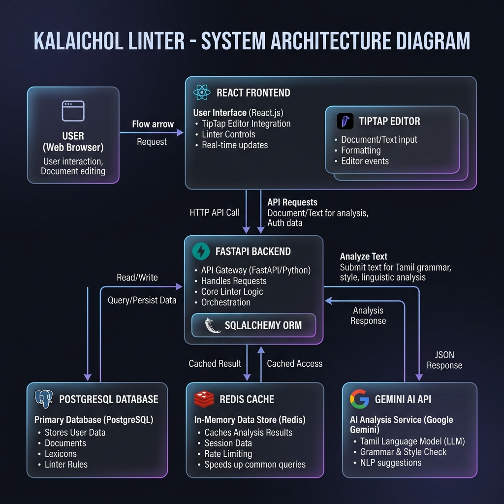
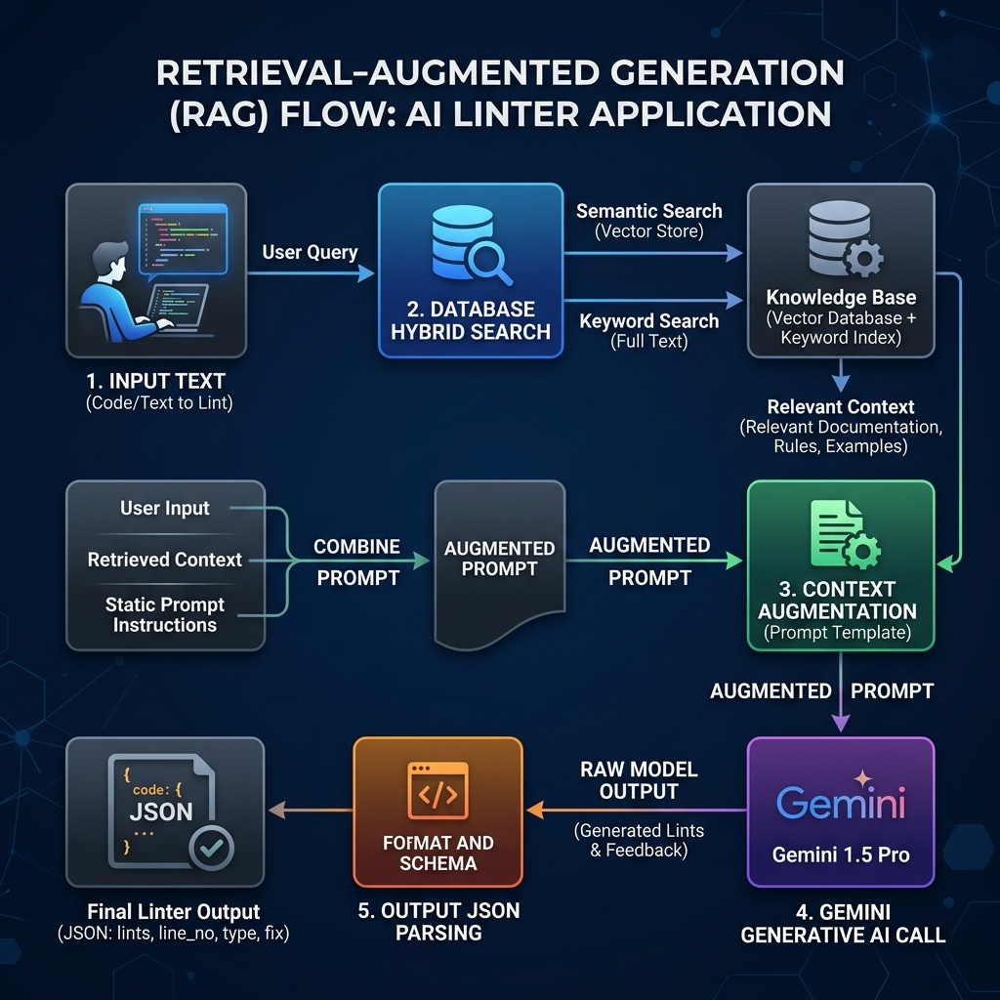
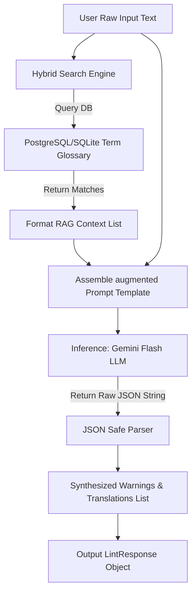

# கலைச்சொல் Linter System Architecture

This document provides a technical overview of the system architecture and runtime flow of the **கலைச்சொல் Linter (MozhiMathi-AI)** application.

---

## 1. System Architecture Overview

The system is designed around a three-tier architecture:
1. **Frontend Client**: SPA written in **React 19** and compiled via **Vite**, featuring a real-time rich text editor built on the **TipTap (ProseMirror)** framework.
2. **Backend Server**: Fast and async REST API written in **FastAPI (Python)**, orchestration layer matching words against a local database and leveraging LLMs.
3. **Storage & Caching Layer**: 
   * **PostgreSQL / SQLite**: Houses the structured terminology glossary, domain classifications, and academic sources.
   * **Redis Cache**: Temporarily caches JSON payloads for lint requests to ensure sub-millisecond response times for repeating inputs.
   * **Gemini Flash (LLM)**: Performs language detection, grammar analysis, and phonetic/English translations.

### System Block Diagram
Below is the visual block diagram of the system layers:

---

## 2. Core Runtime Flows

### A. Linting Request Pipeline (RAG + Cache + LLM)
When a user types text in the editor and triggers a scan, the backend processes the input through a multi-stage pipeline:

```mermaid
sequenceDiagram
    autonumber
    participant Client as React Client (TipTap)
    participant Redis as Redis Cache
    participant API as FastAPI Backend
    participant DB as PostgreSQL / SQLite
    participant Gemini as Gemini AI API

    Client->>API: POST /api/v1/linter/lint { "text": "..." }
    
    rect rgb(20, 30, 40)
        Note over API, Redis: Stage 1: Fast Cache Check
        API->>Redis: GET linter:cache:[MD5_HASH]
        alt Cache Hit
            Redis-->>API: Return Cached JSON
            API-->>Client: 200 OK (Instant Response)
        end
    end

    rect rgb(30, 40, 50)
        Note over API, DB: Stage 2: Database Hybrid Matching (RAG)
        API->>DB: Query Terminology Glossary
        DB-->>API: Match exact terms, trigrams, and authority coefficients
    end

    rect rgb(40, 50, 60)
        Note over API, Gemini: Stage 3: LLM Context Augmentation
        API->>Gemini: Generate content with RAG glossary context
        Gemini-->>API: Return JSON (detected language, translations, explanations)
    end

    rect rgb(20, 30, 40)
        Note over API, Redis: Stage 4: Cache Response
        API->>Redis: SETEX linter:cache:[HASH] 3600s [JSON]
    end

    API-->>Client: 200 OK (Full Lint Response)
```

---

## 3. Component Details

### 1. TipTap Highlighter Extension
On the client side, rather than updating states inline, a custom ProseMirror plugin is configured:
* **Decorations**: Spans text nodes, wraps loan words in classes (`linter-flagged`, `linter-verified`, `linter-ai`), and underlines them dynamically.
* **Hover Tooltips**: Listens to ProseMirror `mouseover` events, fetches coordinates, and positions a responsive tooltip popover card containing translations and correct-usage examples.

### 2. Hybrid Matching Scoring Algorithm
The database search uses a composite scoring algorithm to find glossary equivalents:
$$\text{Score} = w_{\text{exact}} \cdot \text{ExactMatch} + w_{\text{trigram}} \cdot \text{TrigramSimilarity} + w_{\text{vector}} \cdot (\text{VectorSimilarity} \cdot \text{SourceAuthority})$$

* **Source Authority Weights**:
  * Anna University: $1.0$
  * University of Madras: $0.9$
  * Community Proposed: $0.7$

---

## 4. Detailed AI & RAG Pipeline Flow

This section details how the linter coordinates the Retrieval-Augmented Generation (RAG) context to ensure Gemini provides deterministic translations aligning with academic authorities:

### RAG Steps Description

1. **Query Term Extraction**: The linter parses input words, scans the local database using SQL, Trigram, and Semantic Vector similarity to find verified technical term translations.
2. **Context Assembly**: The matched dictionary mappings are compiled into a structured string context (e.g. `Term: Variable -> Pure Tamil: மாறி`).
3. **Prompt Injection**: The assembly compiles this glossary context and the user's raw text into a strict system prompt instruction template:
   * *"Here is a list of verified technical terms. You MUST prioritize and use these exact translations when rewriting the sentence..."*
4. **Structured JSON Inference**: The prompt is processed by the **Gemini model** (configured with `response_mime_type="application/json"` and `temperature=0.2`).
5. **Output Synthesis**: The backend parses the structured JSON, merges RAG annotations with any supplemental warnings flagged by the LLM, caches the response, and outputs the refined payload.

### Pipeline Flowchart

