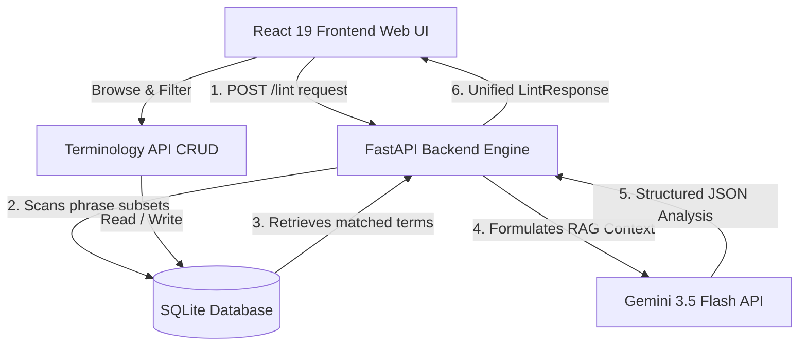

# செம்மொழி Linter (MozhiMathi-AI)
## Classical Tamil Technical Terminology & Lexical Linter Suite

This documentation provides a comprehensive overview of the **செம்மொழி Linter (MozhiMathi-AI)** project, detailing its purpose, functional behaviors, technical architecture, and algorithmic mechanics from both a non-technical and technical perspective.

---

## 1. Non-Technical Perspective

### What is the செம்மொழி Linter?
In modern technology, engineering, and digital communications, the Tamil language is frequently blended with English words (resulting in "Tanglish") or written using heavy phonetic loan words. While this facilitates quick expression, it dilutes linguistic purity and creates a barrier for formal technical education, localization, and standardized translations.

The **செம்மொழி Linter** is an intelligent web suite designed to scan, analyze, and clean Tamil technical writing. It acts as an automated editor that flags technical jargon, colloquial slangs, and English loan words, suggesting pure, verified classical Tamil equivalents approved by recognized academic bodies (such as Anna University and the University of Madras).

### Core Features & Value Propositions
*   **Linguistic Rich Text Editor**: An interactive word-processor style interface that checks your text in real time. It underlines problematic words (similar to Grammarly) and shows definitions, example sentences, and suggestions upon hovering.
*   **University Glossary Directory**: A searchable database containing over 1,000 verified technical terms. Users can browse, filter by category/domain, and submit new term proposals to expand the lexicon.
*   **Hybrid Search Analyzer**: A diagnostics panel that visualizes exactly how the search engine matches terms. Users can modify weights and observe the mathematical breakdown of how a query is calculated.
*   **Dual-Rewrite Output**: The linter provides two versions of rewrites:
    1.  *Pure Tamil*: Replaces all foreign words with formal, classical Tamil equivalents (excellent for official documents, academic papers, and textbooks).
    2.  *Phonetic/Common Tamil*: Replaces words while preserving natural sentence flow and using phonetic transliterations where pure terms feel too complex (ideal for casual blogs, subtitles, and user interfaces).

### User Personas
*   **Translators & Localizers**: Ensuring software, documentation, and user interfaces adhere to standard Tamil terminology guidelines.
*   **Educators & Content Creators**: Preparing textbook material, programming courses, or lectures in pure Tamil.
*   **Developers & Technical Writers**: Linting code comments, readmes, and technical articles to eliminate Tanglish elements.

---

## 2. Technical Perspective

### High-Level System Architecture
The suite operates under a standard client-server paradigm, leveraging a local relational database for structured glossary lookups and Google's Gemini models for advanced linguistic analysis.



---

### Backend Architecture
The backend is built with **FastAPI**, providing high performance, auto-generated OpenAPI documentation, and asynchronous capability. 

*   **Database**: SQLite via **SQLAlchemy** ORM. Database schemas are designed for standard relational integrity, separating domains, categories, sources, and definitions.
*   **Seed Module**: Pre-loaded with normalized domains (e.g., Software Engineering, Data Science) and sources (e.g., Anna University Glossary, University of Madras).

#### Database Schema Model Relationships
*   `Term`: The main terminology entity (`english_term`, `tamil_term` [phonetic], `pure_tamil_term`, `confidence_score`, `is_verified`).
*   `Domain` & `Category`: For logical categorization.
*   `Source`: Represents the origin authority (e.g., "Anna University Glossary").
*   `TermEmbedding`: Caches high-dimensional vectors generated from `text-embedding-004` to avoid redundant external network calls.
*   `Definition`, `Example`, `Synonym`: Enrichment tables to store definitions and sentence mappings in both English and Tamil.

---

### Algorithmic Mechanics

The core value of the backend linter is its multi-layered matching and cleaning pipeline.

#### 1. Advanced Hybrid Search Strategy
When text is input, the engine tokenizes the content into words and sliding window phrases (1, 2, and 3-word combinations) to capture multi-word technical concepts (e.g., "Data Structure"). For each candidate phrase, the engine calculates a composite match score against the entire dictionary:

$$\text{Composite Score} = w_{\text{exact}} \cdot M_{\text{exact}} + w_{\text{trigram}} \cdot M_{\text{trigram}} + w_{\text{vector}} \cdot M_{\text{vector}} \cdot C_{\text{source}}$$

Where:
*   **Exact Match Score ($M_{\text{exact}}$)**: Returns `1.0` if the phrase matches either `english_term` or `tamil_term` exactly (case-insensitive); otherwise `0.0`. Default weight $w_{\text{exact}} = 0.5$.
*   **Trigram Fuzzy Score ($M_{\text{trigram}}$)**: Computed using char-level trigram sets to match typos or slight spelling variations (e.g., "algoritm" matching "algorithm"). Default weight $w_{\text{trigram}} = 0.3$.
*   **Vector Semantic Score ($M_{\text{vector}}$)**: Evaluates semantic similarity by generating dense embeddings utilizing Gemini’s `text-embedding-004` model and computing Cosine Similarity. Caches vectors locally in the `TermEmbedding` table. Default weight $w_{\text{vector}} = 0.2$.
*   **Source Authority Coefficient ($C_{\text{source}}$)**: A scaling coefficient multiplier representing trust levels of the term source:
    *   *Anna University*: `1.0`
    *   *University of Madras*: `0.9`
    *   *Standard/Verified*: `0.8`
    *   *Community Proposed*: `0.7`

#### 2. Deduplication & Overlap Resolution
Because sliding windows create overlapping candidates (e.g., for the phrase "Fast API compiler", candidates include "Fast", "API", "compiler", "Fast API", and "API compiler"), the engine resolves overlaps using an interval schedule sorting approach:
1.  Candidates are sorted by starting position index, then by span length (descending), and then by composite match confidence (descending).
2.  The engine iterates through the sorted candidates, keeping the highest-scoring candidate and pruning any overlapping intervals.

#### 3. RAG and Gemini AI Reasoning Pipeline
Once local database matches are identified, they are formatted as **Ground Truth Reference Context** (Retrieval-Augmented Generation pattern) and injected into a strict system prompt sent to `gemini-3.5-flash`.

The prompt instructs the model to:
*   Perform language identification (`en`, `ta`, or `ta-Latn` [Tanglish]).
*   Evaluate spelling, grammar, and style metrics.
*   Prioritize local database translations for exact matched terms.
*   Scan for other slangs or jargon not present in the local database.
*   Construct the overall "Pure Tamil" and "Phonetic Tamil" rewrites.
*   Return a structured JSON output satisfying Pydantic schema schemas.

#### 4. Heuristic Fallback Engine
If the `GEMINI_API_KEY` is not present, or if external calls fail (rate limiting/network outage), the engine automatically falls back to a **Heuristic Rules Engine**. This fallback matches phrases using the local SQLite database via exact and trigram matching, calculates basic language distribution metrics based on unicode block boundaries (Tamil block `0x0B80` to `0x0BFF`), and builds fallback rewrites.

---

### Frontend Architecture
The user interface is powered by **React 19**, styled using a glassmorphic color palette with **Tailwind CSS v4** and **Motion** animations.

#### Real-Time TipTap ProseMirror Editor
The main editor utilizes the **TipTap** editor framework. To enable real-time linting highlights, a custom TipTap extension was engineered:

*   **`LinterHighlighter` ProseMirror Plugin**:
    *   Listens to document updates.
    *   Uses a custom ProseMirror `Plugin` to construct a dynamic `DecorationSet`.
    *   Inspects text nodes and injects inline ProseMirror `Decoration.inline` nodes wrapping identified loan terms.
    *   Applies a dashed underline style: green for officially verified database matches (`linter-verified`) and amber for AI-proposed matches (`linter-ai`).
    *   Hooks into ProseMirror `handleDOMEvents` (specifically `mouseover`) to capture the element's bounding rect and pass the flagged warning details to the React state, rendering an overlay popup tooltip directly at the word's coordinates.

---

### API Specifications

#### 1. Text Linting Endpoint
*   **URL**: `/api/v1/linter/lint`
*   **Method**: `POST`
*   **Payload**:
    ```json
    {
      "text": "Iniki programming loop romba complex ah iruku."
    }
    ```
*   **Response (200 OK)**:
    ```json
    {
      "original_text": "Iniki programming loop romba complex ah iruku.",
      "language_info": {
        "detected_language": "ta-Latn",
        "confidence": 0.95,
        "contains_tanglish": true
      },
      "warnings": [
        {
          "original_term": "programming",
          "suggested_pure_term": "நிரலாக்கம்",
          "phonetic_rendering": "புரோகிராமிங்",
          "start_index": 6,
          "end_index": 17,
          "confidence_score": 0.98,
          "is_verified": true,
          "explanation": "English technical loan word; maps to pure Tamil 'நிரலாக்கம்'.",
          "example_usage": "நிரலாக்கம் கற்க எளிதானது."
        },
        {
          "original_term": "loop",
          "suggested_pure_term": "மடக்கு",
          "phonetic_rendering": "லூப்",
          "start_index": 18,
          "end_index": 22,
          "confidence_score": 0.92,
          "is_verified": true,
          "explanation": "Technical software loop; maps to pure Tamil 'மடக்கு'.",
          "example_usage": "மடக்கு பயன்படுத்தி குறியீட்டை இயக்கவும்."
        }
      ],
      "quality_metrics": {
        "writing_score": 70,
        "readability_level": "Easy",
        "grammar_errors_count": 2
      },
      "suggested_rewrite_pure": "இன்றைய நிரலாக்க மடக்கு மிகவும் சிக்கலாக இருக்கிறது.",
      "suggested_rewrite_phonetic": "இன்றைய புரோகிராமிங் லூப் மிகவும் சிக்கலாக இருக்கிறது."
    }
    ```

#### 2. Glossary Query Endpoint
*   **URL**: `/api/v1/terminology/terms`
*   **Method**: `GET`
*   **Query Parameters**:
    *   `q` (string, optional) - Fuzzy search term query.
    *   `domain_id` (integer, optional) - Filter by domain ID.
    *   `category_id` (integer, optional) - Filter by category ID.
    *   `is_verified` (boolean, optional) - Filter by verification status.
    *   `limit` (integer, optional) - Pagination limit.
*   **Response (200 OK)**: A list of terms containing linguistic structures, definitions, and relationships.

---

### How to Run Locally

#### Prerequisites
*   Python 3.10+ installed.
*   Node.js 18+ (with `pnpm` or `npm`) installed.

#### 1. Setup Backend
1.  Navigate to the `backend` directory:
    ```bash
    cd backend
    ```
2.  Create a virtual environment and activate it:
    ```bash
    python -m venv .venv
    # Windows:
    .venv\Scripts\activate
    # macOS/Linux:
    source .venv/bin/activate
    ```
3.  Install dependencies:
    ```bash
    pip install -r requirements.txt
    ```
4.  Configure environment variables by copying `.env.example` to `.env`:
    ```bash
    copy .env.example .env
    ```
    *Open `.env` and fill in your `GEMINI_API_KEY`.*
5.  Launch the FastAPI server:
    ```bash
    uvicorn app.main:app --reload --port 8000
    ```

#### 2. Setup Frontend
1.  Navigate to the `frontend` directory:
    ```bash
    cd ../frontend
    ```
2.  Install dependencies:
    ```bash
    npm install
    ```
3.  Launch Vite developer server:
    ```bash
    npm run dev
    ```
    *The web UI will be accessible at `http://localhost:3000`.*
